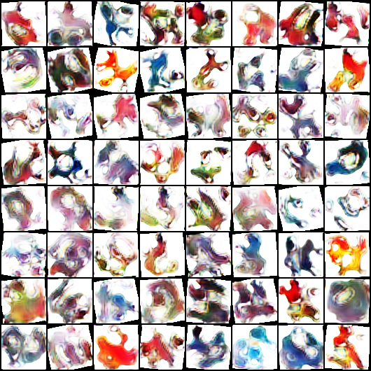
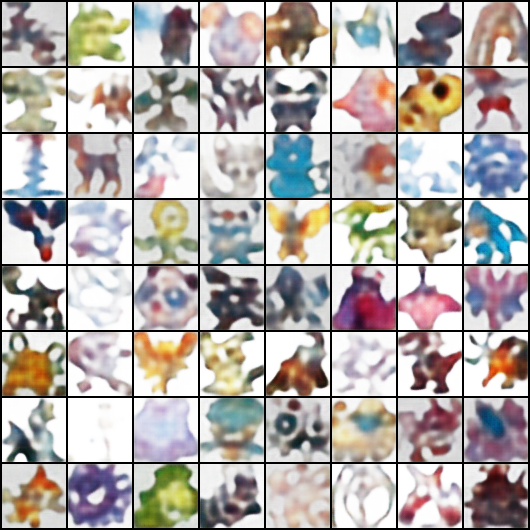

# Pokémon Image Generation using VAE and GAN

This project implements a Variational Autoencoder (VAE) and a Generative Adversarial Network (GAN) from scratch in PyTorch to generate 64x64 Pokémon-style images.

## 🚀 Features
- Custom PyTorch implementation of:
  - DCGAN with spectral normalization
  - Variational Autoencoder with β-VAE support
- Apple Silicon GPU acceleration using MPS backend
- Data augmentation for small dataset stabilization
- TTUR (Two Time-Scale Update Rule)
- Instance noise for GAN stabilization

## 📂 Dataset
The models are trained on the **Complete Pokémon Image Dataset** containing ~2,500 high-quality images.
- **Source:** [Pokémon Images Dataset (Kaggle)](https://www.kaggle.com/datasets/kvpratama/pokemon-images-dataset)
- **Format:** 64x64 RGB Images
- **Structure:** Images are organized into generational subfolders (Gen1, Gen2, etc.), which are parsed recursively by the data loader.

## 🏗️ Project Structure
```text
Pokemon_VAE_GAN/
├── main.py            # Main entry point for training
├── vae.py             # VAE architecture & loss function
├── gan.py             # GAN (Generator/Discriminator) architecture
├── utils.py           # Data loaders & image saving utilities
├── results_vae/       # Reconstructions & training progress images
├── results_gan/       # Generated Pokémon samples
├── models/            # Saved .pth model weights
├── requirements.txt   # List of dependencies
├── README.md          # Project documentation
└── .gitignore         # Files excluded from GitHub (weights/data)
```

## 🧠 Models

### VAE
- Encoder → μ and logσ²
- Reparameterization trick
- Decoder with Sigmoid output
- β-VAE loss

### GAN
- Generator with transposed convolutions
- Discriminator with spectral normalization
- BCEWithLogitsLoss
- Label smoothing
- Extra generator step
- Instance noise

## 📈 Results

GAN samples after 300 epochs:



VAE samples:



## ⚙️ Run

1. Installation

```bash
pip install -r requirements.txt
```

2. Training
The script automatically detects Apple Silicon (MPS), CUDA, or CPU:

```bash
python main.py
```

The final results of the training runs (200-300 epochs) will be saved in the results_vae/ and results_gan/ folders.

---

## 📌 Summary

This project demonstrates the implementation and training of deep generative models (VAE and GAN) to synthesize novel Pokémon-style images. It highlights training stabilization techniques, latent space learning, and practical experimentation with generative modeling.

---

Part of my graduate work in deep generative modeling at Loyola Marymount University.


